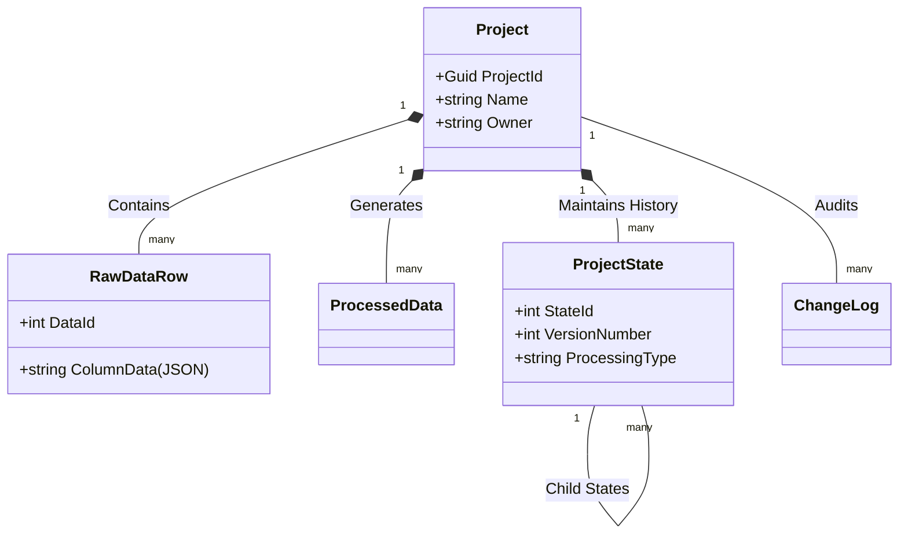

# 🏛️ Isatis ICP - Domain Layer

This library contains the core enterprise business objects and entities for the Isatis ICP application. It represents the heart of the business logic, independent of any data access concerns or user interface frameworks.

## � Overview

The Domain layer is purely focused on the business domain. It defines the key structures that the application manipulates. Being at the center of the Clean Architecture onion, it has **zero dependencies** on other projects.

## 📁 Entities

The `Entities` namespace contains the following key business objects:

### Core Project Management
- **[Project](Entities/Project.cs)**: The central root aggregate. Represents a laboratory analysis project. It acts as a container for all raw data, processed results, and state history.
- **[ProjectState](Entities/ProjectState.cs)**: Represents a snapshot of the project at a specific point in time. Used for version control, undo/redo functionality, and audit trails of data processing steps (e.g., "Import", "Drift Correction").

### Data Handling
- **[RawDataRow](Entities/RawDataRow.cs)**: Represents a single row of initial input data imported into a project, stored in a flexible JSON format to accommodate varying column structures.
- **[ProcessedData](Entities/ProcessedData.cs)**: Stores the results of analysis and adjustments (Quality Control, Corrections, etc.). Like raw data, it uses a JSON payload for flexibility.

### Reference Materials & QA/QC
- **[CrmData](Entities/CrmData.cs)**: "Certified Reference Material". Stores standard reference data used for calibration and quality control checks (e.g., internal standards, lab standards).

### Auditing & Jobs
- **[ChangeLog](Entities/ChangeLog.cs)**: An audit trail recording granular modifications to data points, tracking *who* changed *what*, *when*, and *why*.
- **[ProjectImportJob](Entities/ProjectImportJob.cs)**: Manages the state of background file processing jobs, tracking progress, status, and errors for long-running import operations.

## 📊 Entity Relationship Diagram (ERD)

## 🔐 Design Principles

1.  **POCOs**: All entities are Plain Old CLR Objects.
2.  **No Logic Leakage**: No infrastructure or persistence logic is included.
3.  **Rich Domain**: Entities encapsulate their own data integrity rules where possible (via DataAnnotations).
